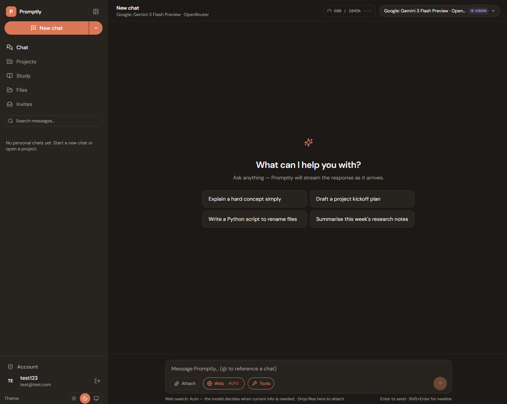

# Promptly

Self-hosted, multi-user AI chat for small groups. Bring your own keys (OpenRouter, OpenAI, Anthropic, or a local Ollama), invite a handful of people, and get a workspace that feels like ChatGPT — except **admins can't read user chats** and every account is behind MFA + an audit log.



## What's in it

- **Chat** — OpenRouter / OpenAI / Anthropic / any OpenAI-compatible base URL, plus a bundled Ollama for local models. Admins curate a model pool; users pick from what they've been allowed. Markdown, code highlighting, file attachments, RAG, per-conversation tool toggles (web search, URL fetch, image gen, PDF gen). Full-text search across every chat you own.
- **Projects** — a bundled system prompt, pinned files, and a group of related chats under one roof.
- **Drive** — upload, preview, rename, move, bulk-select. Trash, starred, recent. Share links with optional expiry. Full-text search over file contents. Per-user storage quotas.
- **Collaborative documents** — a TipTap + Hocuspocus (Y.js CRDT) editor for real-time multi-user docs that live in Drive as first-class files.
- **Study Mode** *(new, still rough)* — give it a topic + goal, an AI planner drafts a 5-20 unit lesson plan, and each unit runs as a tutor session with teach-backs, interactive quizzes, and a server-side 75% mastery gate before the unit is marked complete.
- **Admin** — per-user analytics, cost-by-model dashboard, invite-only registration, TOTP + email OTP + backup codes, trusted-device cookies, account lockout, rate limiting on every sensitive route, and a live console.

## Install

You need `docker` + `docker compose` v2 and `git`. Nothing else — no API keys, no manual `.env` editing.

```bash
git clone https://github.com/tristenlammi/Promptly.git promptly
cd promptly
./install.sh
```

Open `http://localhost:8087` — the first visit launches a 3-step wizard (admin account → public URL → embedding choice).

- **Windows / Docker Desktop:** run `.\install.ps1` instead. If PowerShell blocks the script, `Set-ExecutionPolicy -Scope Process -ExecutionPolicy Bypass` in the same window, then retry.
- **Chat core only** (skip SearXNG and the bundled Ollama): `./install.sh --minimal`.
- **HTTPS:** front it with Cloudflare Tunnel, Caddy, or any other reverse proxy — then paste the public URL into the wizard (or **Admin → Settings** later). The CORS allow-list updates on the fly, no restart needed.

## Docs

- [Operations runbook](docs/operations.md) — Unraid, TLS, backups, upgrades, troubleshooting.

## Security

- Registration is invite-only; open `/register` returns 403.
- Every write endpoint requires auth. MFA is opt-in per user, enforceable per-org by the admin.
- Outbound HTTP from tools goes through an SSRF-aware fetcher.
- Full audit log of logins, lockouts, MFA attempts, and rate-limit trips is visible under **Admin → Audit**.

Please open a private GitHub security advisory rather than a public issue for any vulnerability report.

## License

No formal license declared yet. If you want to use this commercially, open an issue and we'll talk.
