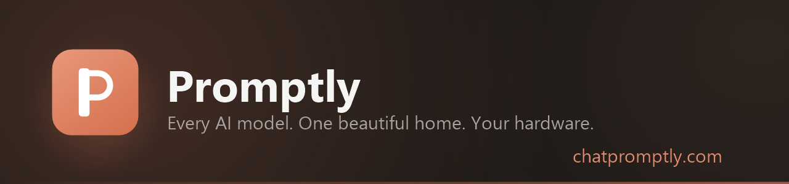

<div align="center">



**The self-hosted AI workspace.** Chat with any model, research with agents,
collaborate in Workspaces, talk out loud, automate the boring parts —
all on hardware you control.

[](https://chatpromptly.com)
[](LICENSE)
[](#install)

**[See it in action → chatpromptly.com](https://chatpromptly.com)**

</div>

---

## Install

One command. Any machine that runs Docker (Compose v2 ≥ 2.20).

```bash
git clone https://github.com/tristenlammi/Promptly.git && cd Promptly && ./install.sh
```

Windows PowerShell: `.\install.ps1`

The script generates all secrets, builds and starts the stack, and waits for
it to come up healthy. Open **http://localhost:8087** and the first-run wizard
takes it from there — admin account, optional public URL, embeddings, MFA.

By default Promptly is **cloud-first**: connect your API keys (OpenAI,
Anthropic, OpenRouter, …) in the wizard. It does not bundle an Ollama
container — but if you're already running Ollama natively on the host, the
installer detects it and wires the stack to it automatically.

| Install option | Effect |
| :-- | :-- |
| `--with-ollama` | Bundle a local-model container. GPU auto-detected: NVIDIA (CUDA), AMD (ROCm), else CPU |
| `--no-search` | Skip the bundled SearXNG web search — add Brave/Tavily keys later in Admin |

PowerShell spelling: `-WithOllama`, `-NoSearch`.

**Want local models?** A **native** Ollama ([ollama.com](https://ollama.com))
is the best option on every platform — better GPU support than the container,
and the installer auto-wires it. Use `--with-ollama` only when you'd rather
Docker manage it; on Linux that gives real GPU acceleration (NVIDIA via the
[Container Toolkit](https://docs.nvidia.com/datacenter/cloud-native/container-toolkit/install-guide.html),
AMD via ROCm), while on macOS/Windows the container is CPU-only (Docker can't
reach the GPU there). The choice persists in `COMPOSE_PROFILES` in `.env`.

## Highlights

- **Every model** — Anthropic, OpenAI, Google, DeepSeek, 300+ via OpenRouter, local models via Ollama, any OpenAI-compatible endpoint
- **Parallel agents & deep research** — fan a question out to concurrent research agents; get one merged, cited brief
- **Workspaces** — chats, notes, canvas, boards and sheets sharing one retrieval layer
- **Voice** — self-hosted Whisper dictation and Kokoro read-aloud; hands-free voice mode
- **Automations** — node-graph flows on cron/webhook triggers with a credentials vault
- **Multi-user & secure** — invite-only accounts, MFA, audit log, per-user quotas, admin analytics
- **Private by architecture** — zero telemetry; pair with local models and search for a fully offline stack

The full tour — live demos included — is at **[chatpromptly.com](https://chatpromptly.com)**.

## Updating

```bash
./update.sh                 # Linux/macOS  (pull + rebuild + recreate + reload nginx + health check)
.\update.ps1                # Windows
```

Re-running `./install.sh` still works and is safe (it keeps your secrets and
data), but `update.sh` is preferred for updates: it reloads the bind-mounted
nginx config, uses the right compose profiles so SearXNG/Ollama aren't
dropped, and waits for the backend to come back healthy.

## Backup

Everything lives in `./data/` next to the compose file — Postgres, Redis,
Ollama models, uploads. Back up that folder and you have everything.

## License

[MIT](LICENSE)
